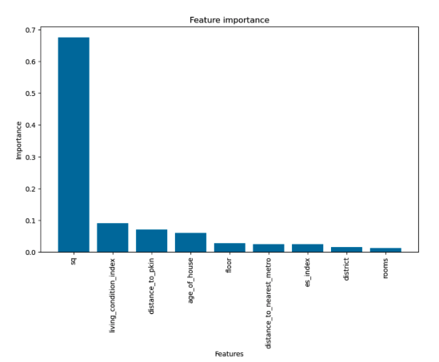
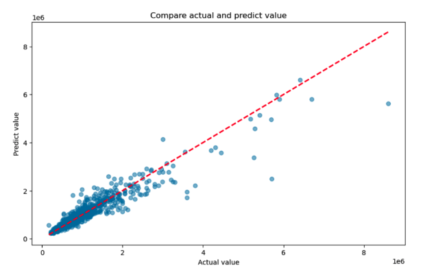

# Warsaw house price prediction – Business-oriented insights

## Project Overview

### Objective  
To build an interpretable and high-performing predictive model for estimating apartment prices in Warsaw, Poland. The project supports **data-driven decision-making in mortgage risk assessment, real estate investment, and urban planning**.

### Business Context  
The residential property market in Warsaw is fast-evolving, influenced by factors like urban infrastructure development, sustainability policies, and ESG (Environmental, Social, Governance) considerations. Accurately estimating apartment prices helps:  
- Financial institutions to set accurate Loan-to-Value (LTV) ratios  
- Real estate investors to identify under/over-valued areas  
- Urban planners to detect areas needing intervention

---

## Dataset Structure

The dataset was sourced from a Polish real estate portal and filtered down to **8,926 listings in Warsaw**.

### Key Columns and Metrics

| Variable | Description | Type |
|----------|-------------|------|
| `sq` | Size of apartment in square meters | Numeric |
| `rooms` | Number of rooms | Numeric |
| `floor` | Floor number | Numeric |
| `price` | Apartment price in PLN | Target (Numeric) |
| `year` | Year built | Date/Numeric |
| `district` | Administrative district in Warsaw | Categorical |
| `distance_to_pkin` | Distance to city center (Palace of Culture and Science) | Numeric |
| `distance_to_nearest_metro` | Distance to closest metro station | Numeric |
| `living_condition_index` | Score based on access to education, hospitals, parks, etc. | Numeric (0–1) |
| `es_index` | Score based on air quality and crime rate | Numeric (0–1) |
| `age_of_house` | Derived from `year` | Numeric |

> All missing values handled and skewed distributions transformed.  
> Random noise added to some features to avoid overfitting to location-specific patterns.

---

## Insights Summary

### 1. Key Metrics Identified

- **Apartment Area (`sq`)** is the strongest driver of price – explains ~50% of variance.
- **Living Condition Index** highly correlates with price. Districts with better access to education, healthcare, parks, and commerce see 20–30% higher prices.
- **Distance to City Center (`distance_to_pkin`)** and **Metro Access** both show negative correlation with price – the closer, the more expensive.
- **Environmental-Safety Index (`es_index`)** also influences price, but its effect varies across districts.

### 2. Metric Trends & Patterns

- **Price vs Area**: Linear trend with diminishing return beyond 100 m².
- **Price vs Age of House**: Newer apartments generally priced higher; however, historic buildings in central districts still command premium prices.
- **Living Condition Index** is unequally distributed – central & western districts outperform.
- **Underpricing Detected**: High ES index areas far from metro are underpriced → potential investment zones.

### 3. Root Causes of Prediction Error

- **High-value outliers** (luxury apartments in Śródmieście, Wilanów) not well predicted.
- **District effect** still present despite feature engineering → model struggles to generalize across drastically different neighborhoods.
- **Synthetic indices (LCI & ES)** rely on public data approximations – may not fully reflect ground reality.

---

## Recommendations

### For Real Estate Investment Teams:
- Focus on **mid-sized apartments (50–70 m²)** in districts with **high LCI but mid ES scores**. These tend to be undervalued relative to amenities.
- Consider building a **composite “Investment Opportunity Score”** combining price/m², LCI, and ES index.

### For Banks / Mortgage Risk Teams:
- Use the model to flag overvalued listings (>30% over predicted price).
- Adjust **LTV ratios** based on ES index and age of house – older apartments in poor environmental zones are riskier.

### For Urban Planners & Policymakers:
- Use **LCI and ES index maps** to identify underserved districts.
- Consider investment in public infrastructure near undervalued metro-accessible areas with good environmental metrics.

### For Future Model Improvement:
- Collect **transaction-level sale data** rather than listing prices.
- Add **Governance indicators** to the ESG composite score.
- Use **SHAP or LIME** for feature attribution and local interpretability in production.

---

## Authors  
**Team: Flying Vietnamese – ING Risk Modelling Challenge Premilinary Task 2025**  
